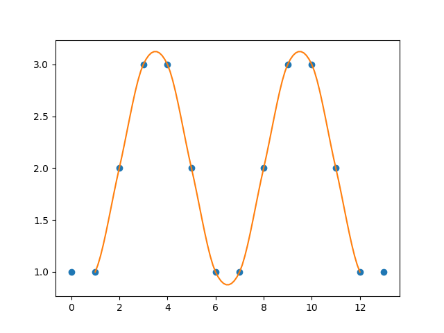

# Cubic interpolation

## Usage:

```python
>>> from lib import CubicInterpolate
>>> array = [1, 2, 3, 4, 5]
>>> i = CubicInterpolate(array)
>>> i.use(2.5)
3.5
```

## Demo:

```python
from matplotlib import pyplot as plt
from numpy import linspace

from lib import CubicInterpolate

array = [1, 1, 2, 3, 3, 2, 1, 1, 2, 3, 3, 2, 1, 1]
plt.plot(array, 'o')

i = CubicInterpolate(array)
curve_x = linspace(0, len(array) - 1, 100)
curve_y = []
for x in curve_x:
    curve_y.append(i.use(x))

plt.plot(curve_x, curve_y)
plt.show()
```

